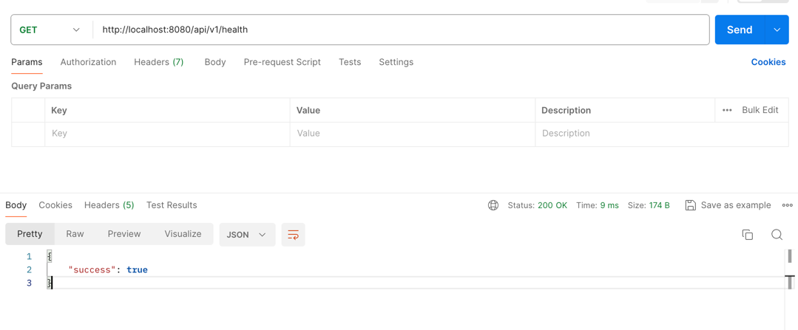

# gc-mock-api

- Modify below config in application.yml
```
mockapi:
  endpoints:
    - uri-path: /api/v1/health
      json-file-path: /tmp/health-success.json
    - uri-path: /api/v1/users
      query-params:
        userId:
          "1": /tmp/user-1.json
          "2": /tmp/user-2.json
      json-file-path: /tmp/all-users.json
```

## Test
```dtd
curl --location 'http://localhost:8080/api/v1/health'
```
